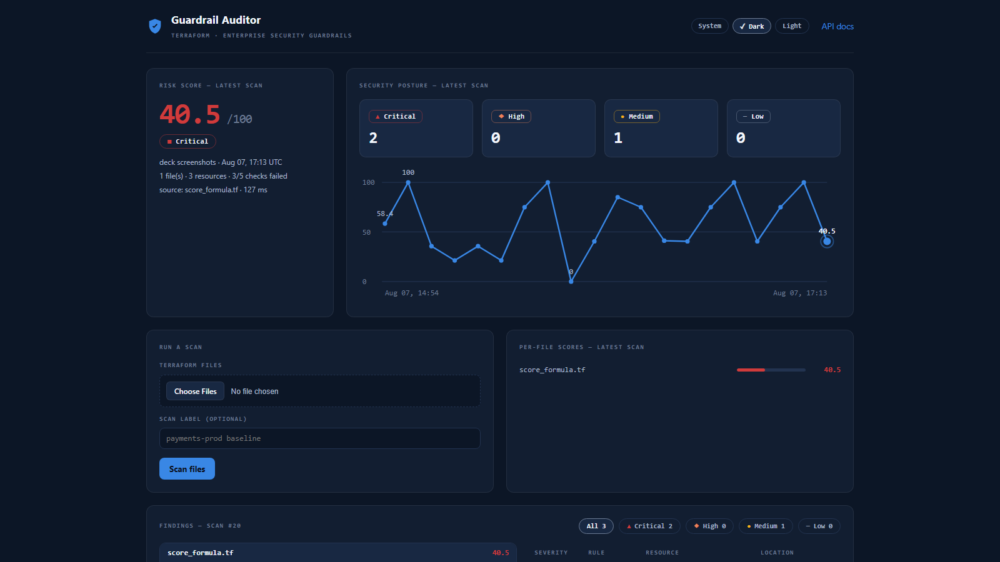
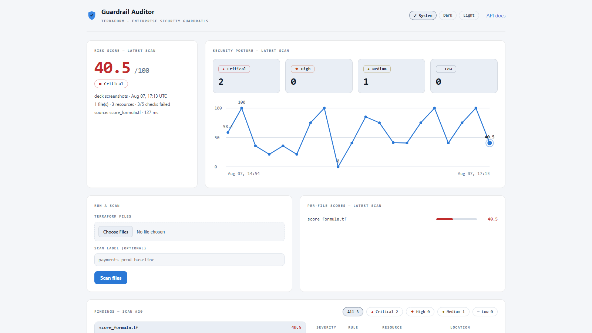
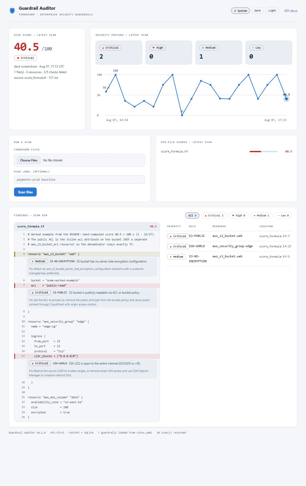

## Terraform · Enterprise Security Guardrails

# **Guardrail Auditor**

An API-first security auditor for Terraform: seven guardrails as data, findings
with file / line / evidence, a severity-weighted risk score — and one
server-rendered dashboard with zero client JavaScript.

*Built 2026-08-07, in one session. Every line written by an AI; every step gated by a human.*

---

## The exercise

# Vibe coding, **with a gate**

- The human architects and gates: spec, approvals, written amendments, audits — and **never edits a line**.
- The AI writes everything end to end: code, tests, fixtures, docs, every commit.
- Nothing lands unverified: pytest on every turn, plus live checks against the running app in a real browser.

The discipline is the product; the scanner is the proof.

---

## What was built

# A working auditor, **not a mock**

- **7 guardrails** for Terraform: public S3 (ACL or policy), SSH & RDP world-open (IPv4 **and** IPv6), S3 & EBS encryption, RDS public, IAM `Action "*"`.
- **API-first**: FastAPI + SQLite — 5 endpoints, multipart upload, OpenAPI docs, clean operationIds.
- **Server-rendered dashboard**: annotated source view, severity filter, per-file scores, score trend, System/Dark/Light theming.
- **38 tests**: golden fixtures asserting exact *(rule, resource, line)* triples, a hand-computed score fixture, end-to-end form flows, CRLF regressions.

---

## How it works

# One page, plain HTTP, **zero client JS**

- One server-rendered page — zero client JS, zero CDN: runs offline from a fresh clone.
- Upload via form or API — one shared pipeline, same limits (multipart `POST /api/v1/scans`).
- Annotated source: every finding lands on its own line — `file:line`, evidence, fix beneath.
- Posture at a glance: severity tiles plus a score trend across persisted scans (SQLite).
- Deep-linkable: filter = query param, code line = fragment anchor; theme rides a cookie (System / Dark / Light).

---

## The dashboard, live

# Real captures from the **running app**

  
  

*Left: the populated dashboard — 20 real scans on the trend. Right: the annotated source view at native scale — highlighted line, rule, message, fix. Captured by headless Chrome from the live app; local repo assets, so the deck still renders offline.*

---

## Rules are data

# Closing a gap with **zero engine changes**

- `rules.yaml` with a closed operator vocabulary — `exists`, `absent`, `eq`, `contains`, `open_port`. No eval, ever.
- The extensibility test appends a brand-new YAML rule to a copied pack — it fires with **zero code changes**.
- Case in point: the IPv6 world-open gap was closed by adding two `open_port {port, cidr: "::/0"}` clauses — a pure YAML edit.
- Verified live: the **running** server picked the clauses up on the very next scan. No restart, no deploy.

The spec promised rules-as-data. The repo proves it twice.

---

## Process

# Spec first — even after the AI **ran ahead**

- Turn 1 generated a full application instead of stopping at "acknowledge". It was frozen and committed honestly: *"initial draft from the opening prompt, pre-spec"*.
- A one-page SPEC followed — user-approved (v2), then amended **in writing before** every change.
- The draft was audited into compliance through four verified, committed slices; everything off-spec was deleted, and every deletion logged.
- `prompts.md` records every prompt **verbatim**, each with three lines: intent / what changed / how it was verified.

---

## Honest clock

# T0 → MVP in **2:33**, against a 4–6h goal

- T0 fixed at the first message: `2026-08-07T14:46:28+02:00`. Every turn ends with Elapsed read from the **system clock** — never estimated.
- MVP milestone: commit `f692820`, elapsed **2:33** (recorded in `prompts.md`).
- Even the milestone-timestamp correction is its own commit (`d73a66a`) — the history admits its mistakes.
- The clock kept running past MVP: theming, annotated source view, IPv6 clauses — all logged the same way.

---

## Numbers

# Every figure below is **checkable in the repo**

| Metric | Value | Where to check |
| --- | --- | --- |
| Tests passing | 38 | `python -m pytest -q` |
| Guardrails / operators | 7 / 5 | `rules.yaml` |
| API endpoints | 5 | `/openapi.json`, README curl section |
| Golden fixtures | 11 | `tests/fixtures/*.tf` |
| Commits through `b8f04da` | 34 | `git rev-list --count b8f04da` |
| Prompts logged verbatim | 28 turns | `prompts.md` |
| Themes | 2 + System | `/theme/{system,dark,light}` |
| Manual code edits by the human | 0 | `CLAUDE.md` rule, `prompts.md` log |
| Remotes / pushes during the build | 0 — published once, by the human, at submission | `prompts.md` close headers |

---

## Limits & next

# Deterministic core, **honest edges**

- Known limitations (README): single-scan semantics — no module resolution (the S3 encryption companion is the one cross-resource link); policy matching is textual — `jsonencode()` isn't parsed; the interactive `/docs` needs network (the curl section is the offline reference).
- Roadmap: a thin CLI over the API for CI gates · more port rules **as data** · CloudFormation.
- Where GenAI slots in next: LLM-drafted remediation *explanations* behind a seam — opt-in, and **outside the verdict path**.

The scanner itself stays deterministic by design.

---

## Closing

# The repo **is** the talk

| File | What it proves |
| --- | --- |
| `README.md` | how to run (Windows + Unix), the score formula, curl for every endpoint, known limitations |
| `SPEC.md` | the approved contract, plus every amendment in writing |
| `prompts.md` | every prompt verbatim — intent / change / verification, T0 to now |
| `rules.yaml` | the 7 guardrails as editable data |
| `tests/` | 38 tests: golden fixtures, the 40.5 formula, the extensibility proof, the CRLF regressions |

*No remote existed and nothing was pushed while the work was done — the `prompts.md` close headers record it. Publication happened once, by the human, at submission. Clone it, run pytest, open the dashboard.*
